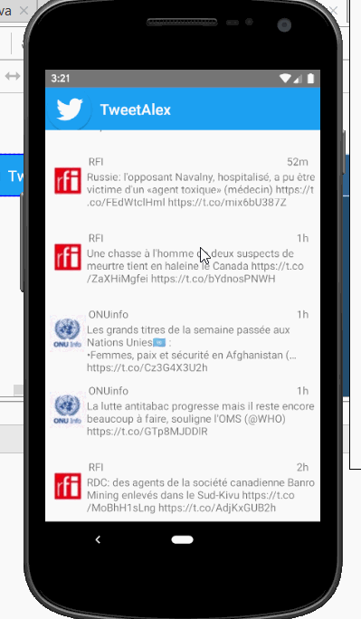

# Project 2 - *SimpleTwitterALex*

**SimpleTwitterALex** is an android app that allows a user to view his Twitter timeline. The app utilizes [Twitter REST API](https://dev.twitter.com/rest/public).

Time spent: **9** hours spent in total

## User Stories

The following **required** functionality is completed:

- [X] User can **sign in to Twitter** using OAuth login
- [X]	User can **view tweets from their home timeline**
  - [X] User is displayed the username, name, and body for each tweet
  - [X] User is displayed the [relative timestamp](https://gist.github.com/nesquena/f786232f5ef72f6e10a7) for each tweet "8m", "7h"
- [X] User can refresh tweets timeline by pulling down to refresh

The following **optional** features are implemented:

- [X] User can view more tweets as they scroll with infinite pagination
- [X] User can tap a tweet to display a "detailed" view of that tweet
- [ ] User can open the twitter app offline and see last loaded tweets
- [X] On the Twitter timeline, leverage the CoordinatorLayout to apply scrolling behavior that hides / shows the toolbar.
- [ ] Replace all icon drawables and other static image assets with [vector drawables](http://guides.codepath.org/android/Drawables#vector-drawables) where appropriate.
- [ ] User can see embedded image media within the tweet detail view
- [ ] User sees an **indeterminate progress indicator** when any background or network task is happening
- [ ] User can **see embedded image media within a tweet** on list or detail view.
- [X] User can **click a link within a tweet body** on tweet details view. The click will launch the web browser with relevant page opened.
- [ ] User can view following / followers list through any profile they view.
- [X] User is using **"Twitter branded" colors and styles**

The following **additional** features are implemented:

- [ ] List anything else that you can get done to improve the app functionality!

## Video Walkthrough

Here's a walkthrough of implemented user stories:

GIF created with [LiceCap](http://www.cockos.com/licecap/).

## Notes

Describe any challenges encountered while building the app.

# Project 2 - *SimpleTwitterALex 2*

**SimpleTwitterALex 2** is an android app that allows a user to view his Twitter timeline and post a new tweet. The app utilizes [Twitter REST API](https://dev.twitter.com/rest/public).

Time spent: **5** hours spent in total

## User Stories 

The following **required** functionality is completed:

- [X] User can **compose and post a new tweet**
  - [X] User can click a “Compose” icon in the Action Bar on the top right
  - [X] User can then enter a new tweet and post this to twitter
  - [X] User is taken back to home timeline with **new tweet visible** in timeline
  - [X] Newly created tweet should be manually inserted into the timeline and not rely on a full refresh
  - [X] User can **see a counter with total number of characters left for tweet** on compose tweet page

The following **optional** features are implemented:

- [X] User can **pull down to refresh tweets timeline**
- [X] User is using **"Twitter branded" colors and styles**
- [ ] User sees an **indeterminate progress indicator** when any background or network task is happening
- [ ] User can **select "reply" from detail view to respond to a tweet**
  - [ ] User that wrote the original tweet is **automatically "@" replied in compose**
- [X] User can tap a tweet to **open a detailed tweet view**
  - [ ] User can **take favorite (and unfavorite) or reweet** actions on a tweet
- [ ] User can **see embedded image media within a tweet** on list or detail view.

The following **bonus** features are implemented:

- [X] User can view more tweets as they scroll with infinite pagination
- [ ] Compose tweet functionality is build using modal overlay
- [ ] Use Parcelable instead of Serializable using the popular [Parceler library](http://guides.codepath.org/android/Using-Parceler).
- [X] Replace all icon drawables and other static image assets with [vector drawables](http://guides.codepath.org/android/Drawables#vector-drawables) where appropriate.
- [ ] User can **click a link within a tweet body** on tweet details view. The click will launch the web browser with relevant page opened.
- [ ] User can view following / followers list through any profile they view.
- [X] User can see embedded image media within the tweet detail view
- [ ] Use the popular ButterKnife annotation library to reduce view boilerplate.
- [X] On the Twitter timeline, leverage the [CoordinatorLayout](http://guides.codepath.org/android/Handling-Scrolls-with-CoordinatorLayout#responding-to-scroll-events) to apply scrolling behavior that [hides / shows the toolbar](http://guides.codepath.org/android/Using-the-App-ToolBar#reacting-to-scroll).
- [ ] User can **open the twitter app offline and see last loaded tweets**. Persisted in SQLite tweets are refreshed on every application launch. While "live data" is displayed when app can get it from Twitter API, it is also saved for use in offline mode.

The following **additional** features are implemented:

- [ ] List anything else that you can get done to improve the app functionality!

## Video Walkthrough

Here's a walkthrough of implemented user stories:

GIF created with [LiceCap](http://www.cockos.com/licecap/).

## Notes

Describe any challenges encountered while building the app.

## Open-source libraries used

- [Android Async HTTP](https://github.com/loopj/android-async-http) - Simple asynchronous HTTP requests with JSON parsing
- [Glide](https://github.com/bumptech/glide) - Image loading and caching library for Android

## Open-source libraries used

- [Android Async HTTP](https://github.com/loopj/android-async-http) - Simple asynchronous HTTP requests with JSON parsing
- [Glide](https://github.com/bumptech/glide) - Image loading and caching library for Android

## License

    Copyright [yyyy] [name of copyright owner]

    Licensed under the Apache License, Version 2.0 (the "License");
    you may not use this file except in compliance with the License.
    You may obtain a copy of the License at

        http://www.apache.org/licenses/LICENSE-2.0

    Unless required by applicable law or agreed to in writing, software
    distributed under the License is distributed on an "AS IS" BASIS,
    WITHOUT WARRANTIES OR CONDITIONS OF ANY KIND, either express or implied.
    See the License for the specific language governing permissions and
    limitations under the License.
